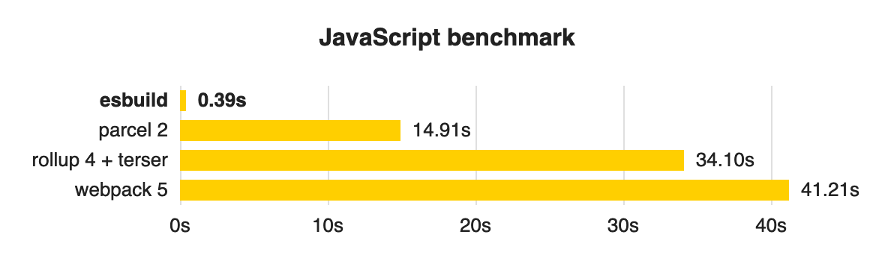
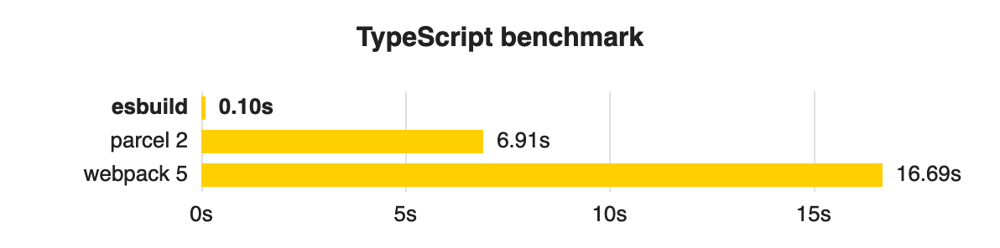
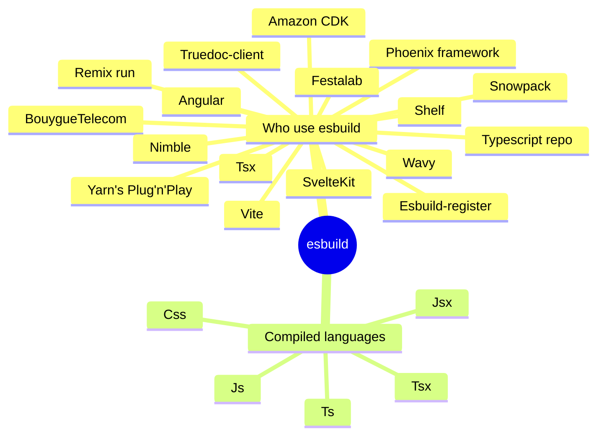

<!-- --------------------------Cover page------------------------------ -->

<div class="center mt-0 p-0">
<div class="text-5xl">

Esbuild</div>

</div>

**An extremely fast bundler for the web**

<div class="abs-br m-6 flex gap-2">
  <button @click="$slidev.nav.openInEditor()" title="Open in Editor" class="text-xl slidev-icon-btn opacity-50 !border-none !hover:text-white">
    <carbon:edit />
  </button>
  <a href="https://github.com/evanw/esbuild" target="_blank" alt="GitHub" title="Open in GitHub"
    class="text-xl slidev-icon-btn opacity-50 !border-none !hover:text-white">
    <carbon-logo-github />
  </a>
</div>


<!-- ------------------Start pages of slide here----------------------- -->

---
layout: default
hideInToc: true
---

# Table of contents
<Toc maxDepth="1"></Toc>

---

# What is esbuild?

It is an extremely fast JavaScript and CSS bundler and minifier. Current build tools for the web are 10-100x slower than they could be. The main goal of this project is to bring about a new era of build tool performance, and create an easy-to-use modern bundler along the way

- It developed by Evan Wallace, creator of Figma
- Written in Go
- First release: 2020
- 36.5k stars sur github

---

## Performance

<div grid="~ cols-2 gap-4">
<div>

[Learn more about benchmark details](https://esbuild.github.io/faq/#benchmark-details)


</div>
<div>
<Tweet id="1448714353386086405" scale="0.65" />
</div>
</div>

---





---

# Major features

- Extreme speed without needing a cache
- JavaScript, CSS, TypeScript, and JSX built-in
- An API for CLI, JS, and Go
- Plugins
- Bundles ESM and CommonJS modules
- Bundles CSS including CSS modules
- Tree shaking, minification, and source maps
- Local server, watch mode, and plugins

---

# Who use esbuild?


[Source](https://stackshare.io/esbuild)
---

# Why is it fast?

- It's written in Go and compiles to native code
- Parallelism is used heavily
- Everything in esbuild is written from scratch
- Memory is used efficiently

<div class="pt-12">
Each one of these factors is only a somewhat significant speedup,
but together they can result in a bundler that is multiple orders of magnitude faster than other bundlers commonly in use today
</div>

---

# A quick start

## CLI mode

```py {all|2|6|11-14|7|8|all}
# Install
npm add -D esbuild

# Add build command to package.json
"scripts": {
    "build-dev": "esbuild src/index.ts --bundle --platform=node --outfile=dist/index.js --format=esm --target=es2022",
    "build": "tsc --noEmit && build-dev",
    "watch": "esbuild src/index.ts --bundle --watch --platform=node --outfile=dist/index.js --format=esm --target=es2022"
}

--bundle indicates that it should output only one file containing our entire bundle.
--platform=node indicates that it should bundle for Node.js.
--outfile=dist/index.js indicates that it should output the bundle to dist/index.js.
--format=esm indicates that it should use ES Modules for imports and exports.
```

[Build options details](https://esbuild.github.io/api/#build)
---

## Scripts mode

```py
# build.js
import esbuild from'esbuild'
import fp from 'fast-glob'

const entryPoints = fg.sync(['src/**/*.[tj]s'])

esbuild
    .build({
            entryPoints,
            outdir: 'dist',
            platform: 'node',
            sourcemap: true,
            target: 'es2022',
            format: 'esm',
    })
    .catch(() => process.exit(1))

```
---

## An extremely simple React starter kit

```py{all|2-10|13|16-20}
# Project structure
src/
├─ components/
│  ├─ app.module.css
│  ╰─ app.tsx
├─ index.html
├─ index.tsx
├─ livereload.js
├─ style.css
╰─ types.d.ts

# livereload.js
new EventSource("/esbuild").addEventListener("change", () => location.reload());

# dev server command
esbuild src/index.html src/index.tsx \
  --loader:.html=copy \
  --outdir=build --bundle --watch \
  --servedir=build --serve-fallback=src/index.html \
  --inject:src/livereload.js
```

[Implementation details](https://jakelazaroff.com/words/an-extremely-simple-react-starter-kit/)


---
src: ./pages/learn-more.md
hide: false
---

---
src: ./pages/thanks.md
hide: false
---